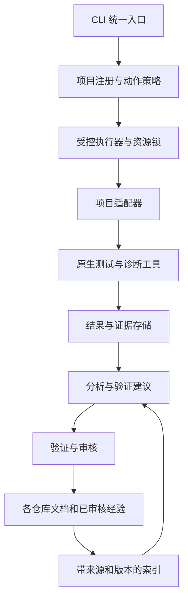

# 架构决策

日期：2026-09-09。状态：P0 基线与 P1 首个执行闭环已实现，详见 [P1 当前能力与限制](p1-runner.md)；其余适配器和知识组件待实现。

## 产品边界

通用的是任务入口、证据记录和知识管理；测试框架、业务正确性、设备和服务环境属于项目适配层。支持逐步接入异构项目，不承诺零配置自动完成所有测试。

首版采用 Python 3.12/Linux、本地 CLI 与每次运行的独立监督进程，协议保持语言无关。2026-09-07 合成探针验证了 literal argv、进程组取消和中文 Markdown/hash/JSON；Node 20 子进程候选也通过，选择 Python 是为了复用现有 SOP 经验，不是性能结论。详见 [运行时决策](runtime-decision.md)。其他平台未验收；Agent Mail 首动作仅在隔离副本中完成原生对照。

## 组件关系

分析输出通过已登记动作和策略检查后才可进入执行器，不允许模型自行构造任意 shell 命令。日志和检索文档作为数据处理，其中出现的指令不具有执行权限。

## 项目与运行标识

- `project_id` 是稳定身份，不从目录名临时推断。
- `checkout_id` 区分同仓库 worktree；`git_common_dir` 等实际资源身份用于协调锁。
- 备份、临时工作目录和归档不自动注册成独立项目。
- 记录提交 SHA、脏工作区标记和本次被测内容摘要；只记录 HEAD 无法描述未提交改动。
- 注册清单控制允许访问的文档与执行根目录，明确符号链接及越界路径策略。

## 知识归属与生命周期

| 资产 | 事实来源 | 中央系统职责 |
| --- | --- | --- |
| 需求、策略、事故、回归说明 | 所属 Git 仓库 | 增量索引、来源定位、版本关联 |
| 测试运行、日志、截图和报告 | 运行证据目录 | 标识、校验、访问控制、保留与导出 |
| 可跨项目复用的经验 | 审核后的知识文档 | 去除项目私有细节，保留来源、适用条件和验证记录 |
| 搜索索引 | 可由上述来源重建 | 更新、删除传播、去重、失效处理 |

知识流转：`draft → reviewed → verified → stale/superseded`。`reviewed` 表示审阅，不能代替实际验证；`verified` 必须附验证范围和证据。原文仍是历史事实时，索引可以保留历史版本，但不能默认为当前方案。

首版先做 Markdown 标题/段落级解析与关键词检索，验证中文和代码符号查询；语义检索是否必要由样本评测决定。关系元数据与本地证据目录先满足单用户场景，再决定数据库与对象存储方案。不要在第一版同时引入多个测试管理、RAG 和可观测性平台。

现有 AgentMemory 可作为后续经验检索适配器。当前本地 adapter 要求显式项目匹配，且有非项目范围工具：不能绕过其隔离限制构造全局混合记忆池。中央数据库、项目 Git 文档和 AgentMemory 不得都成为同一事实的独立可写主副本。

## 执行与可靠性

- 动作声明超时、网络、密钥、副作用、依赖和资源锁；策略默认拒绝未声明动作。
- 资源锁覆盖 checkout、共享依赖、数据库、Redis、设备及必要端口；锁超时和遗留锁处理必须有证据。
- 取消和超时终止整个进程组并记录结果。协调进程崩溃恢复时不能把未完成运行转成成功。
- 区分进程退出、测试结果和验收结论。报告缺失、零测试、跳过和不支持环境不能默认为 PASS。
- 原始证据受限保存；可检索材料先脱敏，外部模型调用按项目策略决定。禁止把所有生产日志直接写入 Git 或发送给模型。
- 重试保留独立 attempt。偶发失败不能被最后一次成功覆盖。

## 分阶段交付

1. P0：协议、样本、运行时选择、证据和权限边界。
2. P1：fixture Runner 与三个适配器，统一结果和原生执行对照。
3. P2：文档增量索引与 Bug—修复—回归证据闭环。
4. P3：根据实际使用选择 Web、MCP、ReportPortal/Allure、远程 runner、语义检索或运行数据集成。

P3 均为后续候选，不计入首版完成条件。在线排障、生产变更、发布和外部记忆写入分别按实际授权执行。
